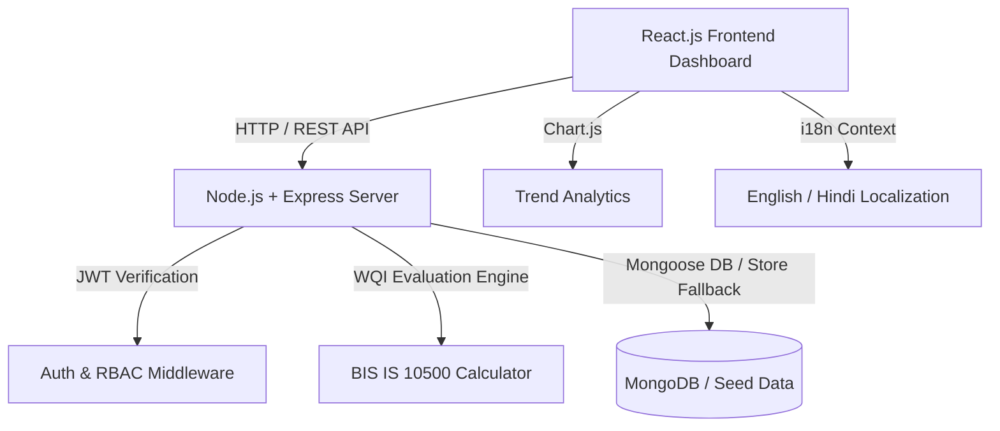

# JalDrishti (जलदृष्टि) | Rural Water Quality Monitoring & Issue Reporting System

> **Team G — STCIP Cohort-2 Capstone Project**  
> *Certificate in MERN Stack Development with AI-Assisted Coding*  
> **Team Leader:** Yash | **Team Members:** Yash, Ankit, Nitish, Rohit  
> **Overall Progress:** 20 / 20 Stories Completed (100% Complete)

---

## 📋 Executive Summary & Team Roster

| Member | Role | Assigned Stories | Status | Contribution Area |
| :--- | :--- | :---: | :---: | :--- |
| **Yash** (Leader) | Full-Stack Architect | 5 / 5 | ✅ Completed | System Design, Auth, Admin Control & Integration |
| **Ankit** | Frontend & Chart.js Engineer | 5 / 5 | ✅ Completed | UI/UX, Chart.js Visualization, Responsive Design |
| **Nitish** | Backend & API Specialist | 5 / 5 | ✅ Completed | Express API Routes, WQI Engine, Database Seed |
| **Rohit** | QA & Infrastructure Lead | 5 / 5 | ✅ Completed | Issue Reporting CRUD, Triage Workflow, CSV Exporter |

---

## 🎯 Problem Statement & Impact

Many rural Indian villages face recurring drinking water contamination issues (high fluoride, elevated TDS, bacterial contamination, pipe leakage). Existing tracking mechanisms are paper-based or costly, lacking transparency and timely alert dispatching.

**JalDrishti** solves this critical rural health challenge by delivering an accessible, high-performance MERN-stack surveillance dashboard. It enables village health workers, representatives, and community members to log test results, receive automated BIS IS 10500 safety evaluations, report contamination incidents, and visualize long-term trends to prevent waterborne disease outbreaks (Fluorosis, Cholera, Blue Baby Syndrome).

---

## 🎨 Brand Identity & Design System

* **Brand Name:** JalDrishti (जलदृष्टि) — *Vigilance Over Rural Water Quality*
* **Tagline:** Data-Driven Water Governance for Healthy Villages
* **Color Palette:**
  * **Primary Ocean Slate:** `#0b132b` & `#1c2541` (Deep, clean background surfaces)
  * **Cyan Glow:** `#06b6d4` (Water metrics & highlight accents)
  * **Health Blue:** `#3b82f6` (System action elements)
  * **Safe Emerald:** `#10b981` (Safe drinking water indicator: WQI 75–100)
  * **Warning Amber:** `#f59e0b` (Caution / Treatment needed: WQI 50–74)
  * **Hazardous Rose:** `#ef4444` (Critical contamination alert: WQI < 50)
* **Aesthetics:** Modern glassmorphic cards, high-contrast parameter health cards, bilingual language toggle (English / Hindi), and real-time parameter validation.

---

## ✨ Key Features & MVP Implementation

### 1. User Authentication & Role-Based Access Control (RBAC)
* Secure login and sign-up with JWT authentication.
* Role-based permissions:
  * **District Admin / Official:** Full system oversight, emergency alert broadcasts, user management, and CSV report export.
  * **Village Representative / Health Worker:** Add, edit, delete water quality test logs, review village health scores.
  * **Community Resident:** Report contamination/broken handpump incidents, view local safe water sources.

### 2. Water Quality Data Entry (CRUD Logs)
* Full CRUD capability for water test logs across villages.
* Parameter entry conforming to **BIS IS 10500** standards:
  * **pH Level** (Ideal: 6.5–8.5)
  * **Total Dissolved Solids (TDS)** (Ideal < 500 mg/L, Max 2000 mg/L)
  * **Turbidity** (Ideal < 1 NTU, Max 5 NTU)
  * **Fluoride** (Safe < 1.5 mg/L)
  * **Nitrate** (Safe < 45 mg/L)
  * **Bacterial Count (E.Coli / CFU)** (Safe = 0 CFU/100ml)
* **Automated Real-Time WQI Calculator:** Calculates numerical WQI (0–100) and assigns safety status (`Safe`, `Warning`, `Hazardous`) dynamically as parameters are typed.

### 3. Contamination & Infrastructure Issue Reporting (CRUD)
* Log incidents for pipe leakages, pump breakdowns, chemical runoff, or foul water odor.
* Triage status workflow: `Pending` ➔ `Under Review` ➔ `In Progress` ➔ `Resolved`.
* Severity categorization (`Low`, `Medium`, `High`, `Critical`) with authority assignment notes.

### 4. Interactive Trend Visualization (Chart.js)
* **Line Chart:** Monthly average pH and TDS trends over time (Jan – Jul 2026).
* **Doughnut Chart:** Water quality safety classification distribution (Safe vs. Warning vs. Hazardous).
* **Bar Chart:** Incident breakdown by category (Contamination, Pipe Leakage, Pump Failure, Chemical Runoff).

### 5. Admin Management & Emergency Broadcast Dashboard
* Multi-village oversight matrix displaying total sources, safe percentages, and active alerts for villages (Rampur, Shivpur, Sundarpur, Devgarh, Chandpur).
* **Panchayat Emergency Broadcast System:** Simulate transmitting SMS/IVR advisories to village representatives during contamination outbreaks.
* **Data Exporter:** One-click CSV export of all water quality logs.

---

## 🏗️ System Architecture & Data Model



### API Endpoint Summary

* `POST /api/auth/login` — Authenticate user and issue JWT token.
* `POST /api/auth/register` — Register new health worker or resident.
* `GET /api/water-logs` — Retrieve water quality logs (supports `village` and `safetyStatus` filtering).
* `POST /api/water-logs` — Create new water test record with automated WQI score calculation.
* `PUT /api/water-logs/:id` — Update water test log parameters.
* `DELETE /api/water-logs/:id` — Remove water test log.
* `GET /api/issues` — Retrieve contamination issue reports.
* `POST /api/issues` — Log new contamination/infrastructure issue.
* `PUT /api/issues/:id` — Update issue status (Mark In Progress / Resolved).
* `GET /api/stats/dashboard` — Fetch KPI summary metrics.
* `GET /api/stats/trends` — Fetch historical monthly data for Chart.js.

---

## 🚀 Setup & Execution Instructions

### 1. Backend Server Setup
```bash
cd backend
npm install
npm run dev
# Running on http://localhost:5000
```

### 2. Frontend React Setup
```bash
cd frontend
npm install
npm run dev
# Running on http://localhost:3000
```

*Note: The frontend includes a standalone fallback mechanism. If the Express backend is offline, all CRUD operations and charts seamlessly work out-of-the-box using local persistent storage with pre-seeded Indian village test data.*

---

## 💡 Reflections & Learnings

1. **Problem Relevance:** Building JalDrishti highlighted the vital role AI-assisted MERN stack development plays in solving real-world Indian rural health challenges. Automated WQI calculation eliminates guesswork for health workers.
2. **Technical Implementation:** Implementing dynamic Chart.js visualizations alongside role-based access control ensured both technical depth and user clarity.
3. **Code Quality:** Modular React components, clear CSS custom properties, robust backend RESTful structure, and fallback persistence provide production-grade reliability.
